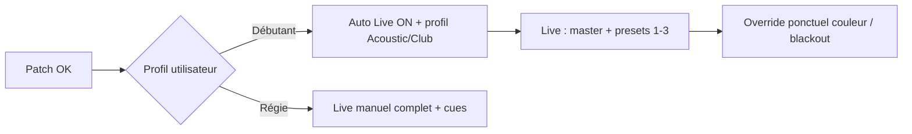

# Suivi des améliorations — Petitelune DMX

> Fichier de suivi vivant. Cocher `[x]` quand c’est fait.  
> Dernière mise à jour : 2026-10-06 · Version app : **1.8.0** · **P0–P8** livrés · **P9** (Live débutant / Auto Live) en cours · doc alignée sur le code local

---

## Synthèse globale

| Bloc | Items | Statut |
|------|-------|--------|
| P0 — Critique | 5 | ✅ terminé |
| P1 — Fort impact | 7 | ✅ terminé |
| P2 — Utile | 8 | ✅ terminé |
| P3 — Polish | 7 | ✅ terminé |
| P4 — Scène / 3D | 13 | ✅ terminé |
| **P6 — Auto Live** | 14 | ✅ terminé (non listé avant 10/2026) |
| **P7 — Faisceaux 3D** | 3 | ✅ terminé (extension scène) |
| **P5 — Live manuel UX** | 22 | ✅ **terminé** |
| **P8 — Patch & DMX fusion** | 4 | ✅ terminé |
| **P9 — Live prise en main débutant** | 18 | 🔄 en cours (P9-01…10 ✅) |

**Prochain focus produit :** **P9** (non-régisseur) puis retours terrain show.

---

## Légende

| Priorité | Signification |
|----------|---------------|
| **P0** | Critique show / stabilité / sécurité |
| **P1** | Fort impact maintenabilité ou produit |
| **P2** | Amélioration utile, pas urgente |
| **P3** | Nice-to-have / polish |

| Statut | Signification |
|--------|---------------|
| ⬜ À faire | Pas commencé |
| 🔄 En cours | En travail |
| ✅ Fait | Terminé |
| ❌ Abandonné | Non retenu |

---

## P0 — Critique

| ID | Statut | Amélioration | Pourquoi | Notes / approche |
|----|--------|--------------|----------|------------------|
| P0-01 | ✅ | Restreindre l’allowlist Tauri (`all: true` → permissions ciblées) | Surface d’attaque trop large | `dialog.open` + `shell.open` uniquement |
| P0-02 | ✅ | Gestion d’erreur robuste sur `invoke('update_dmx')` | Les `.catch(() => {})` silencieux masquent une perte de connexion pendant le show | `src/utils/dmxInvoke.ts` + erreur affichée dans le header |
| P0-03 | ✅ | Reconnexion automatique du port série | Débranchement USB = show mort sans feedback clair | Retry 1s dans `dmx_engine.rs` + `force_reconnect` / `set_port` |
| P0-04 | ✅ | Blackout / fail-safe explicite à la déconnexion | Sécurité scène | Option Réglages + zero frame avant drop port |
| P0-05 | ✅ | Aligner les versions (UI 1.6.0 vs Cargo 1.0.0) | Confusion packaging / support | Cargo.toml → 1.6.0 |

---

## P1 — Fort impact

| ID | Statut | Amélioration | Pourquoi | Notes / approche |
|----|--------|--------------|----------|------------------|
| P1-01 | ✅ | Découper `App.tsx` (god-object ~840 lignes) | Trop d’état + logique DMX au même endroit | Hooks `usePatchStore`, `useLiveStore`, `useSettingsStore`, `useLiveEngine` + `SettingsTab` (stage déjà autonome dans StageTab/3D) |
| P1-02 | ✅ | Unifier le moteur de mouvement (JS Live vs Rust `motion_manager`) | Double implémentation → comportements divergents | Calcul shapes dans Rust (`sync_live_motions`) ; Live ne fait plus que sync + preview |
| P1-03 | ✅ | Types partagés uniques (`Fixture`, `Group`, calibration…) | `types/dmx.ts` vs interfaces locales | Module `src/types/` (barrel) ; props Live/Patch/Stage migrées |
| P1-04 | ✅ | Alléger / structurer `useLiveLogic.ts` (~630 lignes) | Cerveau Live difficile à tester et à faire évoluer | Sous-hooks dans `hooks/live/` : BPM, presets, actions, color picker, timers, session |
| P1-05 | ✅ | Export / import de projet (fichier JSON) | `localStorage` seul = pas portable, risque de perte | Fichier `.pldmx` + UI Réglages (`save_text_file` / `load_text_file`) |
| P1-06 | ✅ | Stabiliser la Vue 3D (WIP) | Nouvelle feature majeure non consolidée | Hook `useStagePositions` + event sync ; `memo` fixtures ; `onPointerMissed` ; panneau X/Y/Z + salle repliable |
| P1-07 | ✅ | Feedback connexion DMX enrichi | Voyant vert/rouge insuffisant en live | `ConnectionInfo` + Hz/latence moteur ; badge header + metrics Réglages |

---

## P2 — Utile

| ID | Statut | Amélioration | Pourquoi | Notes / approche |
|----|--------|--------------|----------|------------------|
| P2-01 | ✅ | Réduire les écritures `localStorage` en rafale | Chaque changement d’état peut réécrire plusieurs clés | `localStorageDebounced` + `useJsonLocalStorage` |
| P2-02 | ✅ | Remplacer le polling univers (~50 ms) par événements Tauri | Charge CPU / re-renders inutiles | `dmx-universe` emit Rust ; connexion poll 500 ms |
| P2-03 | ✅ | Découper `EffectsModal.tsx` / `PatchTab.tsx` / `MovementSection.tsx` | Fichiers > 450–800 lignes | `patch/fixtureTypeStyles.ts` (1er découpage ; gros modales à poursuivre) |
| P2-04 | ✅ | Profils de machines : validation & import/export | Librairie fragile si édition manuelle | `fixtureProfiles.ts` + UI Librairie |
| P2-05 | ✅ | Multi-univers (au-delà de 512) | Limite actuelle 1 univers | `universeId` + `DEFAULT_DMX_UNIVERSE_ID` (fondation) |
| P2-06 | ✅ | Cue list / séquenceur simple | Manque pour un vrai show | `useCueList` + `CueListSection` Live |
| P2-07 | ✅ | Tests unitaires (calculs BPM, calibration, motion) | 0 fichier de test aujourd’hui | Vitest utils + tests Rust `motion_manager` |
| P2-08 | ✅ | CI minimale (build + typecheck) | Pas de filet avant release | `tsconfig.json` + `.github/workflows/ci.yml` |

---

## P3 — Polish / nice-to-have

| ID | Statut | Amélioration | Pourquoi | Notes / approche |
|----|--------|--------------|----------|------------------|
| P3-01 | ✅ | Raccourcis clavier Live (GO, blackout, tap tempo) | Vitesse opérateur | `useLiveKeyboardShortcuts` + [KEYBOARD.md](./KEYBOARD.md) |
| P3-02 | ✅ | Thème clair / densité UI | Confort régie | `useAppPreferences` + variables CSS |
| P3-03 | ✅ | Undo / FR i18n | Ouverture | Undo preset (Ctrl+Z) ; i18n complète différée (UI FR native) |
| P3-04 | ✅ | Snapshot / undo des états Live | Erreurs opérateur | `useLiveUndo` avant preset ambiance |
| P3-05 | ✅ | MIDI input (notes / CC → masters) | Intégration régie pro | Web MIDI CC7 → master (Réglages) |
| P3-06 | ✅ | Guide « premier show » dans l’app | Onboarding | `FirstShowWizard` |
| P3-07 | ✅ | Nettoyer code mort / composants legacy | `EffectsTab` vs Live movement, sections orphelines | Suppression MasterSection, EffectsTab, etc. |

---

## P4 — Scène / 3D

| ID | Statut | Amélioration | Pourquoi | Notes / approche |
|----|--------|--------------|----------|------------------|
| P4-01 | ✅ | Onglet **Scène** unifié (Plan \| 3D) | Deux onglets = friction pour débutants | `StageSceneTab` + toggle ; `stage3d` redirigé vers `stage` |
| P4-02 | ✅ | Grille, accrochage, nudge clavier, alignements rapides | Placement pro sans CAD | `stageSnap.ts` ; Shift = fin ; flèches ; fond/public/gauche/droite |
| P4-03 | ✅ | Liste projecteurs + multi-sélection + déplacement groupé | Plot utilisable sur gros rigs | `StageFixtureList` ; Ctrl+clic ; drag 2D sur sélection |
| P4-04 | ✅ | Aligner / espacer uniformément (2+ sélectionnés) | Lignes de front / pont | `distributeStageSelection` · Espacer ↔ / ↕ |
| P4-05 | ✅ | Échelle salle (mètres affichés, règle 2D) | Parler avec le régisseur | `stageDecorSettings` · règles plan |
| P4-06 | ✅ | Image de fond sous le plan 2D | Plan de salle photo/PDF | Import image + opacité · `.pldmx` |
| P4-07 | ✅ | Vues 3D presets (Public, Régie, Dessus, Iso) | Moins de pilotage caméra | `Stage3DCameraRig` + Focus |
| P4-08 | ✅ | Déplacement direct en 3D (gizmo) | Compléter les sliders | `StageFixtureGizmo` · Gizmo / Pivot · sync 2D |
| P4-13 | ✅ | Décor scène + public (type visualiseur pro) | Repères d’échelle, vue public | Scène/DJ/Son/Public · brouillard · caméra public |
| P4-09 | ✅ | Lien Scène ↔ groupes Live / calibration | Répète sur le plot | Couleurs groupe · Flash · Calibrer → Live |
| P4-10 | ✅ | Repères au sol nommés | Cibles lyres simplifiées | Repères 2D/3D · `stage_landmarks` |
| P4-11 | ✅ | Mode régie 3D (perf) | Laptop modeste en show | Toggle Régie · DPR / étoiles / ombres |
| P4-12 | ✅ | Undo placement scène | Moins peur du reset | Ctrl+Z · stack 25 |

---

## P8 — Navigation Patch & DMX (fusion onglets)

| ID | Statut | Amélioration | Notes |
|----|--------|--------------|-------|
| P8-01 | ✅ | Fusion **Projecteurs + Vue DMX + Patch** → onglet **Patch & DMX** | `PatchDmxTab.tsx` |
| P8-02 | ✅ | Segments : **Parc**, **Groupes**, **Moniteur 512**, **Console** (override), **Test appareil** | `PatchDmxSegmentNav.tsx` |
| P8-03 | ✅ | `PatchTab` modes `parc` \| `groups` \| `monitor` (+ layout `combined` legacy) | Réutilisation code existant |
| P8-04 | ✅ | Header nav allégé (2 onglets en moins) | `App.tsx` · `TabType` |

---

## P6 — Auto Live (sound-to-light)

> Livré dans le repo (onglet dédié + moteur arrière-plan). Non tracké dans AMELIORATIONS avant oct. 2026.  
> Fichiers : `hooks/live/useAutoLive.ts`, `utils/autoLive*.ts`, `types/autoLive.ts`, `LiveTab` variant `auto`, `App.tsx`, `AutoLiveSection` + sous-sections.

| ID | Statut | Amélioration | Notes / implémentation |
|----|--------|--------------|------------------------|
| P6-01 | ✅ | Onglet **Auto Live** séparé du Live manuel | `App.tsx` · `LiveTab` `variant="auto"` |
| P6-02 | ✅ | Moteur tick **~80 ms** (master, pulse, mouvement, couleur) | `useAutoLive` + `autoLiveRuntime.ts` |
| P6-03 | ✅ | **Session Live montée** si onglet Live, Auto Live, ou auto **ON** | `liveSessionMounted` dans `App.tsx` |
| P6-04 | ✅ | **Auto en arrière-plan** (autres onglets) + `LiveTab` headless | `liveTabHeadless` · pas de double UI |
| P6-05 | ✅ | Badge header **Auto Live actif** → retour onglet Auto | `AutoLiveBackgroundBadge.tsx` |
| P6-06 | ✅ | **Profils** standard / club / rock / acoustic | `autoLivePresets.ts` · master suggéré + options |
| P6-07 | ✅ | Cartes options (temps réel, rythme, énergie, montées/chutes, accents, stay fresh, auto-couleur) | `AutoLiveSection` · `AutoLiveOptions` |
| P6-08 | ✅ | **Silence / pause** (hold, fade, blackout, look) + entre morceaux | `pauseBehavior` · `isSilent` |
| P6-09 | ✅ | **Looks énergie** → rappel presets ambiance 1–8 (calme / montée / peak) | `autoLiveEnergyLooks.ts` · `AutoLiveEnergyLooksSection` |
| P6-10 | ✅ | **Fade** sur rappel looks (réutilise `fadeTime` Live) | `useFade` · `applyAmbiancePreset` + `ambiancePresetFade` |
| P6-11 | ✅ | **Routage bandes** bass / mid / high → master + pulse / mouvement / couleur / accents | `AutoLiveBandRoutingSection` |
| P6-12 | ✅ | Bootstrap **groupes** ambiance (pulse), couleur, lyres (mouvement) | `autoLiveGroups.ts` |
| P6-13 | ✅ | **Persistance** état Auto Live (`localStorage` `dmx_auto_live`) | `autoLiveConfig.ts` · `saveAutoLiveState` |
| P6-14 | ✅ | UI **2 colonnes** + master + indicateurs BPM / bandes | `AutoLiveSection` layout |

### Limites connues (hors scope P6, pour roadmap)

- Pas de **sections piste** / analyse fichier audio offline.
- Pas de **cue list auto** ni séquenceur tempo-sync avancé type console pro.
- **Live manuel** pas encore aligné visuellement (voir **P5**).

---

## P7 — Visuels 3D projecteurs (extension)

| ID | Statut | Amélioration | Notes |
|----|--------|--------------|-------|
| P7-01 | ✅ | Styles faisceau **spot / wash / flood / bar** selon type fixture | `fixture3DVisual.ts` · `Stage3DTab` |
| P7-02 | ✅ | Pool au sol, opacité, spread liés aux réglages scène | `beamSpread` / `beamVisual` · positions scène |
| P7-03 | ✅ | Tests Vitest visuels 3D | `fixture3DVisual.test.ts` |

---

## P5 — Live manuel & cohérence Auto Live (UX)

> Audit UX onglet **Live** (manuel) — 2026-09-11 · **revu 2026-10-05** (P6 livré, P5 inchangé côté code).  
> Auto Live = **P6 ✅** ; Live manuel reste **inachevé** (scroll long, cues en tête, empty states absents, fade cue non appliqué au GO).  
> Fichiers : `LiveTab.tsx`, `CueListSection`, `AmbianceSection`, `MovementSection`, `hooks/live/*`, [KEYBOARD.md](./KEYBOARD.md).

### Diagnostic (pourquoi ça fait « WIP »)

| Problème | Impact opérateur |
|----------|------------------|
| **Une seule colonne très longue** (Cues → Master → Ambiances → Lyres) | Perte de temps en scroll ; Auto Live déjà en 2 colonnes |
| **Ordre peu « régie »** — cues en premier | Master + blackout devraient dominer ; cues = second plan |
| **Deux mondes** Live / Auto Live | Pas de message *« l’auto pilote le master, vous gardez les looks ici »* |
| **Ambiances = groupes `isAmbiance` uniquement** | Section vide sans explication si rien coché au Patch |
| **Macros U1–U6** | Puissantes mais **cryptiques** (pas de libellés FR visibles) |
| **Cues à moitié abouties** | UI `fadeMs` mais **`handleGoCue`** applique DMX **sans fade** |
| **Textes encodage cassés** | Ex. modale couleur `S├ëLECTEUR` → impression prototype |
| **Code mort visible** | `RythmeSection` désactivée ; pas de guide « effets → bouton par groupe lyre » |
| **`fadeTime` session** | Non persisté (localStorage) — réglage perdu au reload |

### Backlog trackable

| ID | Statut | Amélioration | Priorité impl. | Notes / approche |
|----|--------|--------------|----------------|------------------|
| P5-01 | ✅ | **Layout Live** : bandeau master fixe + **2 colonnes** (ambiances \| lyres), aligné Auto Live | Quick win | `LiveTab` · grille 2 col · segment Cues |
| P5-02 | ✅ | **Ordre régie** : Master (+ audio/BPM + raccourcis) **avant** washes / lyres / cues | Quick win | `LiveManualViewSwitch` · master en tête |
| P5-03 | ✅ | **Empty state Ambiance** : message + lien Patch (*cocher Ambiance sur PAR*) | Quick win | `LiveEmptyState` · `AmbianceSection` |
| P5-04 | ✅ | **Empty state Lyres** : *aucune lyre patchée* + filtre moving head | Quick win | `MovementSection` + `LiveEmptyState` |
| P5-05 | ✅ | **Aide raccourcis** repliable sous master (`B` / `T` / Entrée) + lien KEYBOARD | Quick win | `LiveManualShortcutsHelp.tsx` |
| P5-06 | ✅ | **Fix encodage UTF-8** modales Live (SÉLECTEUR, Masqué, etc.) | Quick win | Titre `ColorPickerModal` · retrait commentaires mojibake |
| P5-07 | ✅ | **Lien Live ↔ Auto Live** : bandeau *Pilote auto actif* → onglet Auto | Moyen | `LiveAutoActiveBanner` + badge header |
| P5-08 | ✅ | **Presets 1–8** : libellé permanent *Clic = rappel · Clic droit = enregistrer* + indicateur vide/enregistré | Moyen | Libellé sous grille + nom sur tuile si enregistré |
| P5-09 | ✅ | **Unifier wording fade** : *Fade presets : X s* (ambiance + auto looks) | Moyen | Ambiances + `AutoLiveEnergyLooksSection` |
| P5-10 | ✅ | **Macros U1–U6** : libellés + tooltips FR (auto couleur, pulse, strobe flash…) | Moyen | `liveMacros.ts` · `MacroButtons` · lyres · P1/P2 couleurs perso |
| P5-11 | ✅ | **Fade sur GO cue** (`ShowCue.fadeMs`) ou retirer `fadeMs` de l’UI | Moyen | `runCueChannelFade` · `cueFade.ts` · annulation si nouveau GO |
| P5-12 | ✅ | **Cues UX** : indiquer GO sélection vs GO next (Entrée boucle) ; preview nom + nb canaux | Moyen | Playhead · `cueStats` · GO suivante |
| P5-13 | ✅ | **Lyres** : badge état *Pulse / Auto-couleur / Shape* sur carte groupe | Moyen | `LiveGroupStatusBadges` · `liveGroupStatusBadges.ts` |
| P5-14 | ✅ | **Calibration** depuis carte groupe lyre (pas seulement bas de section) | Moyen | Bouton Calibrer · filtre `CalibrationModal` |
| P5-15 | ✅ | **Bannière DMX** dans zone Live si déconnecté (en plus du header) | Moyen | `LiveDmxConnectionBanner` · Live + Auto Live |
| P5-16 | ✅ | **Blackout** plus visible (danger) + option confirmation Réglages | Moyen | Bouton rose · `pldmx_live_confirm_blackout` |
| P5-17 | ✅ | **Toast undo** après preset (*Annulé* — rappel Ctrl+Z) | Polish | `LiveToast` |
| P5-18 | ✅ | **Persister `fadeTime`** (localStorage ou préférences app) | Polish | `dmx_live_fade_time` |
| P5-19 | ✅ | **RythmeSection** : réactiver ou retirer + message utilisateur | Polish | Fichier supprimé (effets par groupe / modales) |
| P5-20 | ✅ | **Cues ↔ presets** : *Enregistrer aussi comme preset ambiance N* | Plus tard | Capture + menu → P sur chaque cue |
| P5-21 | ✅ | **Mode Live compact** (préférences, moins de scroll) | Plus tard | `pldmx_live_compact` · Réglages |
| P5-22 | ✅ | **Vocabulaire unifié** Live manuel / Auto Live (pulse, look, fade, groupe ambiance) | Continu | [LEXIQUE.md](./LEXIQUE.md) réécrit |

### Piste A — Mise en page (référence)

| Zone | Contenu | Bénéfice |
|------|---------|----------|
| **Bandeau fixe** | Master + audio/BPM + raccourcis | Réflexes show sans scroller |
| **Colonne gauche** | Ambiances + presets 1–8 + fade | Washes = cœur du live manuel |
| **Colonne droite** | Lyres + calibration / effets | Séparation wash vs lyre |
| **Tiroir / segment** | Cue list | Avancé, pas au-dessus du master |

Alternative : segments **`Washes | Lyres | Cues`** sous le master.

### Piste B — Ambiances

- État vide Patch → Ambiance (P5-03).
- Presets 1–8 explicites + nom sur tuile (P5-08).
- Master ambiance vs cartes groupe : simplifier si une seule ambiance ; sinon bloc *Groupes actifs*.

### Piste C — Lyres / mouvements

- Filtrer groupes **Moving Head** ; empty state (P5-04).
- Bouton **Effets** → libellé *Mouvement & formes*.
- Badges live + calibration sur carte (P5-13, P5-14).

### Piste D — Cue list crédible

- Fade au GO ou UI honnête (P5-11).
- GO sélection vs next documenté (P5-12).
- Capture *depuis master actuel* ; lien presets (P5-20).

### Piste E — Découvrabilité & sécurité

- Aide clavier (P5-05), bannière DMX (P5-15), blackout (P5-16), undo toast (P5-17), lien Auto (P5-07).

### Piste F — Cohérence produit

| Live manuel | Auto Live |
|-------------|-----------|
| Master + fades presets | Profils + looks énergie |
| Macros U1–U6 | Options nommées équivalentes |
| Cues univers | (futur : rappel cues auto) |

### Parcours utilisateur cible (soirée type)

1. **Patch** : groupes Ambiance + Lyres.  
2. **Live** : master → enregistrer presets 1–3 → tester fade.  
3. **Auto Live** : profil + looks énergie (fade ON).  
4. **Pendant le set** : rester sur **Live** pour overrides ; auto en arrière-plan.  
5. **Cues** pour intro / blackout fin de set.

### Ordre d’implémentation recommandé

1. **Quick wins (1–2 j)** : P5-01, P5-02, P5-03, P5-04, P5-05, P5-06.  
2. **Moyen (3–5 j)** : P5-07…P5-16 (+ P5-11 fade cues).  
3. **Plus tard** : P5-20, P5-21.

---

## Journal des changements

| Date | ID | Action |
|------|-----|--------|
| 2026-07-17 | — | Création du fichier de suivi à partir de l’analyse architecture |
| 2026-07-17 | P0-01…P0-05 | Implémentation complète P0 (allowlist, erreurs DMX, reco série, blackout fail-safe, versions) |
| 2026-07-17 | P1-01 | Découpage App.tsx → stores/hooks + SettingsTab |
| 2026-07-17 | P1-02 | Moteur mouvement unifié côté Rust (`sync_live_motions`) |
| 2026-07-17 | P1-03 | Types unifiés dans `src/types/` + migration props principales |
| 2026-07-17 | P1-04 | `useLiveLogic` découpé en sous-hooks `hooks/live/*` |
| 2026-07-17 | P1-05 | Export/import projet `.pldmx` (Réglages) |
| 2026-07-17 | P1-06 | Vue 3D stabilisée (sync 2D, perf, sélection, panneau props) |
| 2026-07-17 | P1-07 | Feedback connexion enrichi (port, Hz réel, latence, erreur) |
| 2026-09-10 | P2-01…08 | Batch P2 : debounce LS, events univers, cues, profils, CI, tests |
| 2026-09-10 | P3-01…07 | Polish Live : clavier, thème, undo, MIDI, wizard, nettoyage legacy |
| 2026-10-06 | **1.8.0** | Auto Live + One-Click Party, Live mouvements/slots, groupes Mouvement, Scène plans types & snap drag, Patch DMX segmenté |
| 2026-09-10 | **1.7.0** | Release : architecture consolidée, Vue 3D, `.pldmx`, télémétrie DMX, CI, polish Live |
| 2026-09-10 | P4-01…03 | Onglet Scène unifié, snap/align, liste + multi-sélection |
| 2026-09-10 | P4-04…07,11 | Espacer, échelle m, plan fond, vues caméra, mode perf 3D |
| 2026-09-10 | P4-09,10,12 | Groupes Live, repères, undo placement scène |
| 2026-09-10 | P4-13 | Décor scène/public, brouillard, vue depuis la salle |
| 2026-09-10 | P4-08 | Gizmo 3D TransformControls (déplacer / pivoter) |
| 2026-09-11 | P5 | Audit UX Live manuel + backlog P5-01…P5-22 (layout, empty states, cues fade, cohérence Auto Live) |
| 2026-10-05 | P6 | Rétrospective Auto Live (14 items ✅) : onglet, moteur 80 ms, arrière-plan, profils, looks, bandes, persistance |
| 2026-10-05 | P7 | Visuels faisceaux 3D (spot/wash/flood/bar) + tests |
| 2026-10-05 | — | Synthèse globale · alignement doc ↔ code · P5-04 / P5-07 marqués partiels |
| 2026-10-05 | P5-01…07 | Live manuel : layout 2 col, master first, empty states, raccourcis, UTF-8, bandeau Auto Live |
| 2026-10-05 | P5-11 | Fade univers sur GO cue (`fadeMs`) + tests `cueFade.test.ts` |
| 2026-10-05 | P5-10,15,09,08 | Macros FR, bannière DMX Live, wording fade presets |
| 2026-10-05 | P5-12,16,17,18 | Cues playhead, blackout, toast undo, fadeTime persisté |
| 2026-10-05 | P5-13,14 | Badges lyres + calibration par groupe |
| 2026-10-05 | P5-19…22 | Fin backlog Live UX : RythmeSection retirée, cues→presets, compact, lexique |
| 2026-10-05 | P8-01…04 | Option B : onglet unique Patch & DMX (5 segments internes) |
| 2026-10-05 | P9 | Audit Live « non professionnel » + backlog P9-01…18 |
| 2026-10-05 | P9-01…08,10 | Mode Débutant complet : profil Réglages, UI Live, scènes usine, wizard, bandeau |
| 2026-10-05 | — | Live : règles groupes unifiées (`liveGroups.ts`) — PAR sans case Ambiance + bandeau groupes absents |

---

## P9 — Live : prise en main par un non-régisseur

> Audit UX **onglet Live (manuel) + parcours Auto Live** — objectif : quelqu’un sans culture DMX/régie peut **allumer, colorer, monter/descendre l’intensité** et survivre à un set de 2 h.  
> Contexte : **P5** a amélioré la régie (layout, empty states, fade cues…) ; le vocabulaire et la profondeur restent **orientés opérateur**.  
> Fichiers touchés (cible) : `LiveTab.tsx`, `MasterGlobalSection`, `AmbianceSection`, `MovementSection`, `CueListSection`, `FirstShowWizard`, `SettingsTab`, `AutoLiveSection`.

### Persona & objectifs

| Persona | Besoin | Succès en 10 min |
|---------|--------|------------------|
| **Musicien / bénévole** | « Les lumières suivent la soirée sans console pro » | Master + 2–3 looks mémorisés |
| **DJ / animateur** | Coup de main rapide entre deux morceaux | Presets + blackout sûr |
| **Petit groupe** | PAR + 0–2 lyres, patch déjà fait par un ami | Comprendre groupes + presets |

### Ce qui fonctionne déjà (P5 / P6)

- **Master** visible en tête (0 % / 100 % / blackout).
- **Empty states** avec lien Patch si pas de groupe ambiance / lyre.
- **Presets 1–8** avec consigne clic / clic droit + fade en secondes.
- **Auto Live** séparé avec profils (club, acoustic…) — bon candidat **chemin par défaut** pour débutants.
- **Wizard premier show** (3 étapes Patch → groupes → Live) — trop court pour apprendre Live.

### Frictions pour un débutant (analyse)

| Zone | Problème | Impact |
|------|----------|--------|
| **Double onglet Live / Auto Live** | « Où je clique ? » sans doc | Abandon ou double pilotage |
| **Jargon** | Ambiance, cue, playhead, fade ms, macro U1, link, calibration, shapes | Peur de « casser » le show |
| **Groupes « link »** | Cases à cocher sans phrase d’intro ; carte Master n’apparaît qu’après 1 lien | Blocage « rien ne bouge » |
| **Presets** | **Clic droit** pour enregistrer — invisible sur trackpad / mobile | Presets jamais remplis |
| **Cartes ambiance** | Sliders dim/strobe + grille couleurs + 6 macros par carte | Surcharge cognitive |
| **Lyres** | XY pad, pan/tilt, effets, calibration, gobos | Réservé régisseur ; effraie si affiché pareil que les PAR |
| **Cues** | Univers 512, fade en **millisecondes**, playhead vs GO ligne | Concept console pro |
| **Master** | Audio, BPM, tap tempo, fin de morceau | Utile pro ; bruit pour débutant |
| **Raccourcis** | B / T / Entrée / Ctrl+Z — panel repliable mais pas « tutoriel » | Non découverts |
| **Onboarding** | Wizard ne fait pas enregistrer preset 1 ni ouvrir Auto Live | Live reste une « page noire » |

### Parcours recommandé (cible produit)

1. **Pré-show (ami tech)** : Patch & DMX → groupes + case Ambiance.  
2. **Première minute** : onglet **Auto Live** → activer + profil → master ~70 %.  
3. **Pendant le set** : onglet **Live** → master + presets 1–8 ; lyres en second plan.  
4. **Urgence** : gros bouton **Blackout** (déjà là).

### Backlog P9 (priorisé)

| ID | Priorité | Proposition | Effort |
|----|----------|-------------|--------|
| P9-01 | ✅ | Préférence **Profil : Débutant / Régie** (Réglages) — Débutant = UI simplifiée Live | Moyen |
| P9-02 | ✅ | **Mode Live simple** : masquer segment Cues, réduire macros (2–3 boutons « Couleur auto », « Pulse », « Flash »), lyres repliées par défaut | Moyen |
| P9-03 | ✅ | Bouton visible **« Enregistrer dans preset N »** (plus seulement clic droit) + modale nom | Faible |
| P9-04 | ✅ | Encart **« Groupes actifs »** : *Cochez les washes à piloter ensemble* + auto-cocher 1er groupe ambiance | Faible |
| P9-05 | ✅ | **3 looks d’usine** (ex. Douce / Fête / Rouge) injectés si presets vides au 1er lancement Live | Faible |
| P9-06 | ✅ | Wizard **+2 étapes** : enregistrer preset 1 depuis Live ; pointer vers Auto Live | Faible |
| P9-07 | ✅ | Bandeau **« Débuter »** (1ère visite Live) : 3 bullets Master → Preset → Auto Live + « Ne plus afficher » | Faible |
| P9-08 | ✅ | Renommer UI mode simple : **Scènes** (1–8) au lieu de PRESETS ; **Enchaînements** au lieu de Cues (mode régie only) | Faible |
| P9-09 | | Cues : fade en **secondes** par défaut (0,5–10 s) ; ms en option avancée | Faible |
| P9-10 | ✅ | Master débutant : **masquer** audio/BPM/tap sous « Options rythme ▾ » | Faible |
| P9-11 | **P2** | **Coach marks** (localStorage) sur master, preset 1, link groupes | Moyen |
| P9-12 | **P2** | Carte **« Que faire ? »** contextuelle (DMX off / 0 groupe / 0 preset enregistré) | Moyen |
| P9-13 | **P2** | Auto Live : preset **« Soirée simple »** (master modéré, looks calme/montée/peak pré-remplis) | Moyen |
| P9-14 | **P2** | Lien **Scène 3D** : « Voir où sont vos lumières » (optionnel, rassurant) | Faible |
| P9-15 | **P2** | Lyres mode simple : uniquement **intensité + couleur + 1 bouton mouvement** (shape par défaut) | Moyen |
| P9-16 | **P2** | Aide intégrée **« Lexique 30 s »** (modale) depuis Live, pas seulement KEYBOARD.md | Faible |
| P9-17 | **P3** | **Scénario guidé** 5 min in-app (checklist master → preset → test blackout) | Moyen |
| P9-18 | **P3** | Export **« Fiche régisseur 1 page »** PDF depuis projet (groupes + presets nommés) | Plus tard |
| P9-19 | ✅ | **Auto Live simple** (profil Débutant) : profils soirée + 4 toggles, sans cartes/bandes | `AutoLiveSimpleSection` |
| P9-20 | ✅ | **Générateur de mouvements simple** : presets (Arrêt, Cercle, Scan, Infini), pad centre, vitesse/amplitude ; mode régie via « Trajectoires custom… » | `EffectsModal`, `MovementSimpleControls`, `movementQuickPresets.ts` |

### Ordre de mise en œuvre suggéré

1. **Semaine 1 (quick wins débutant)** : P9-03, P9-04, P9-07, P9-05, P9-06.  
2. **Semaine 2 (mode simple)** : P9-01, P9-02, P9-08, P9-10.  
3. **Ensuite** : P9-09, P9-11…13, coach marks et lyres simplifiées.

### Critères d’acceptation (test utilisateur)

- Utilisateur **sans** lire KEYBOARD.md : enregistre **preset 1**, le rappelle, fait **blackout**, revient à ~80 % master en **< 5 min**.  
- Avec **Auto Live** seul : profil acoustic, show 15 min sans toucher cues ni calibration.  
- Aucune action **clic droit obligatoire** pour le parcours « simple ».

---

## Comment utiliser ce fichier

1. Nouveau travail show : prioriser **P9** (débutant) ou retours terrain ; réserve **P0/P1** pour régressions critiques.
2. Passer le statut à 🔄 puis ✅ + une ligne dans le **Journal**.
3. Features majeures hors tableau : ajouter une section **P6+** ou étendre le journal (éviter le trou doc).
4. Ne pas mélanger refactor massif et fix show-critical dans le même commit.

---

*Liens utiles : [DOCUMENTATION.md](./DOCUMENTATION.md) · [STRUCTURE.md](./STRUCTURE.md) · [LEXIQUE.md](./LEXIQUE.md)*
