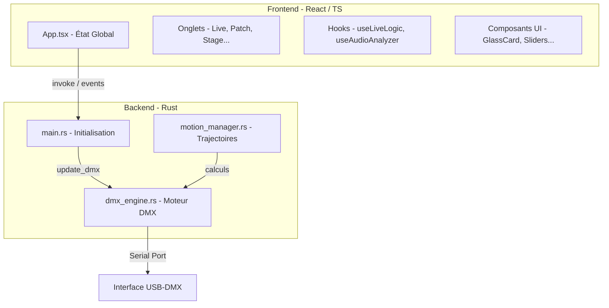

# Structure de l'Application Petitelune DMX

Ce document détaille l'architecture technique de l'application et les interactions entre ses différents composants.

## 1. Vue d'ensemble (Architecture Tauri)

L'application repose sur le framework **Tauri**, qui sépare l'interface utilisateur (Frontend) de la logique système (Backend).

## 2. Flux de Données (Data Flow)

### Du Frontend vers le Backend
1. L'utilisateur interagit avec un composant (ex: déplace le **XY Pad**).
2. Le hook **`useLiveLogic.ts`** calcule les nouvelles valeurs ou détecte le changement.
3. La fonction **`invoke('update_dmx', ...)`** est appelée.
4. Le Backend Rust reçoit la commande, met à jour son buffer interne (**Universe**) et l'envoie via le port série.

### Du Backend vers le Frontend
1. Le Backend maintient un état de connexion et l'état réel de l'univers.
2. Le Frontend reçoit l’univers via l’événement Tauri **`dmx-universe`** (fallback polling) et interroge **`get_connection_info`** ~500 ms (port, erreur, Hz, latence).
3. L'interface React se met à jour pour refléter les changements (ex: moniteur dans **PatchTab** ou **DmxConsoleTab**).

## 3. Détails des Composants Clés

- **`types/`** : Types partagés (`Fixture`, `Group`, mouvements, calibration, scène…). Importer via `from '../types'`.
- **`App.tsx`** : Orchestrateur UI (navigation, composition des onglets). L’état métier est délégué aux hooks stores.
- **`hooks/usePatchStore.ts`** : Fixtures / groupes patchés + CRUD + persistance.
- **`hooks/useLiveStore.ts`** : État Live (mouvements, couleurs, intensités, calibration, BPM…).
- **`hooks/useLiveEngine.ts`** : Boucles temps réel (master, shapes, auto-color, auto-gobo).
- **`hooks/useSettingsStore.ts`** : Connexion série, univers DMX, port, Hz/latence, blackout fail-safe.
- **`components/ui/ConnectionStatus.tsx`** : Badge header (port · Hz · ms · erreur).
- **`components/tabs/`** : Chaque fichier représente un module complet (Live, Patch, Stage…).
- **`components/tabs/Stage3DTab.tsx`** / **`StageTab.tsx`** : Positions scène 2D/3D via `useStagePositions` (`stage_positions` + event sync).
- **`hooks/useStagePositions.ts`** / **`utils/stagePositions.ts`** : Charge / fusionne / persiste les positions partagées.
- **`hooks/useLiveLogic.ts`** : Façade Live (compose `hooks/live/*`).
- **`hooks/live/`** : Sous-hooks — BPM/audio, presets ambiance, actions DMX, color picker, timers pulse/auto-color, état session.

### Backend (src-tauri/src/)
- **`main.rs`** : Configure Tauri et enregistre toutes les fonctions exportées vers le JavaScript.
- **`dmx_engine.rs`** : 
    - Gère l'ouverture du port série (COM).
    - Exécute un thread séparé qui envoie les 512 canaux à une fréquence fixe de 40Hz.
    - Gère le **Manual Override** (priorité manuelle sur les automates).
- **`motion_manager.rs`** : Moteur de trajectoires unique (shapes Live : cercle, huit, balayages, custom + fan/calibration). L’UI synchronise via `sync_live_motions` ; calcul à 40 Hz dans le thread DMX.

## 4. Persistance des Données
Toutes les données de configuration sont stockées dans le navigateur (WebView) via le **`localStorage`**. Cela inclut :
- Le patch des projecteurs.
- La configuration des groupes.
- Les presets d'ambiance et de mouvement.
- Les réglages de calibration.

**Export / import** : un fichier projet **`.pldmx`** (JSON versionné) peut être généré depuis **Réglages → Projet Show**. Il packagé les clés localStorage listées dans `src/utils/projectFile.ts`. L'import réécrit le localStorage puis recharge l'app.

---
*Ce document aide à comprendre comment une action dans l'interface se transforme en lumière physique.*
